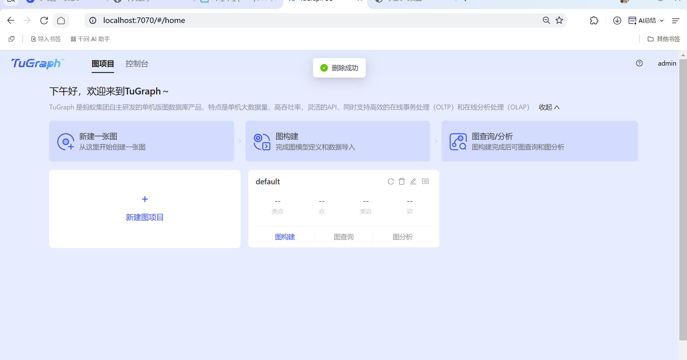
 - 采用docker成功登录
## Transactions Dataset数据集
### 点
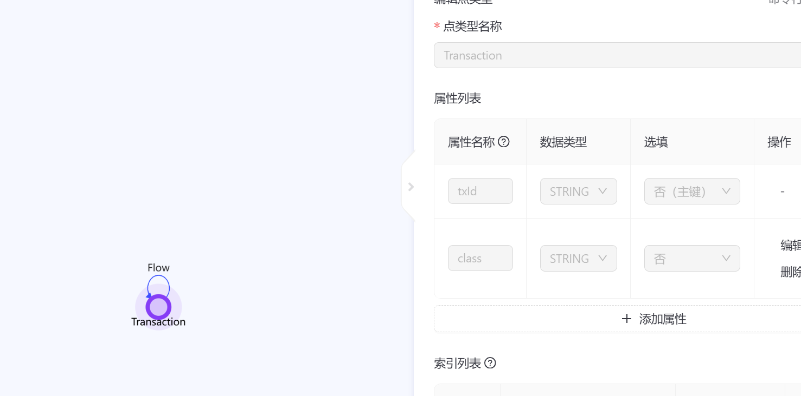
### 边
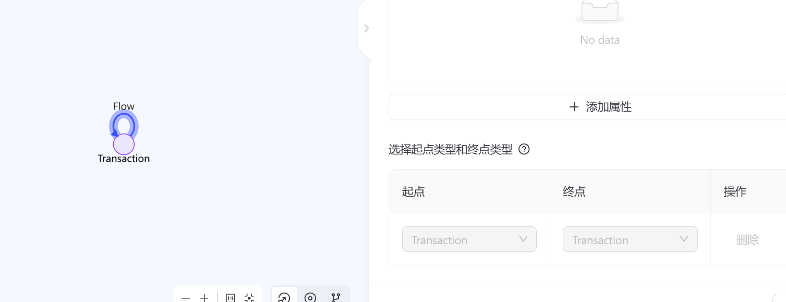
### 导入成果（最大集合点）
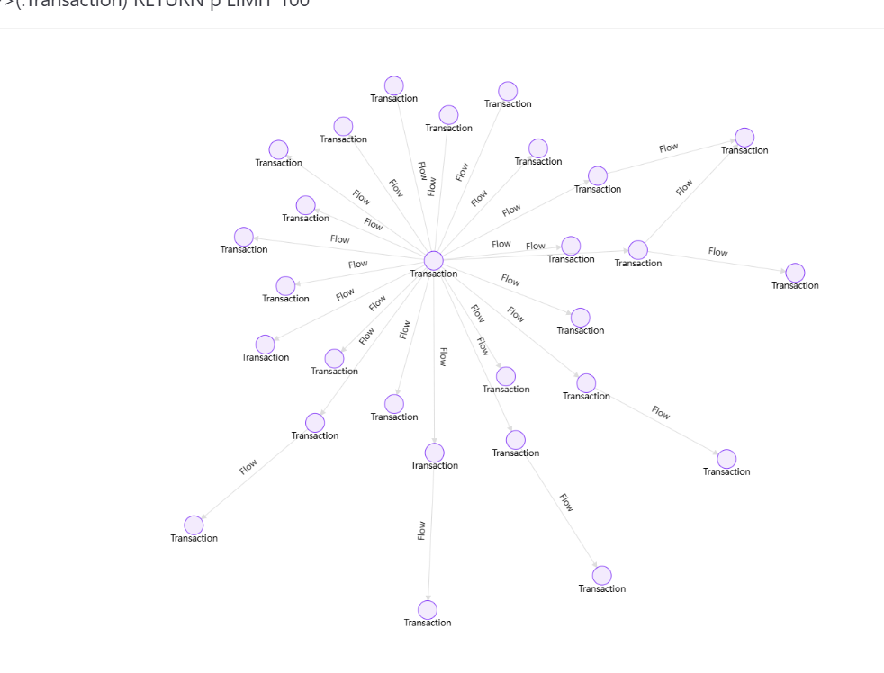
## Actors Dataset数据集
### 点
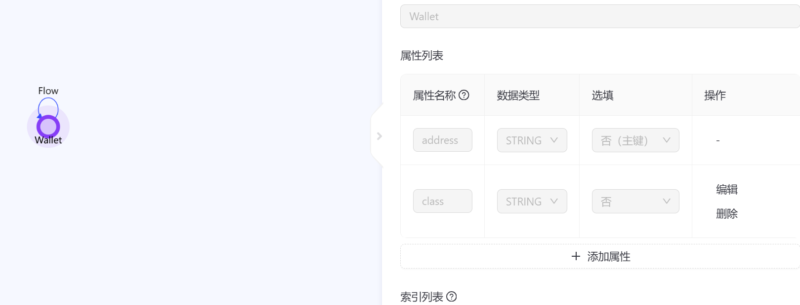
### 边
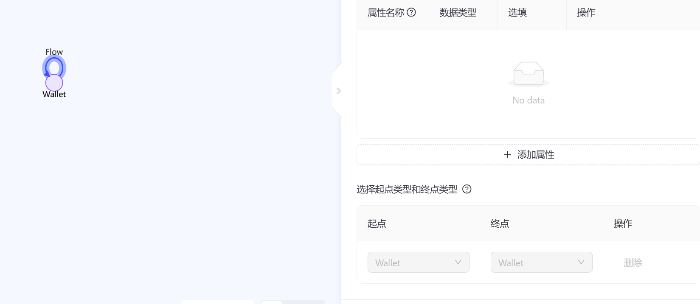
### 导入成果（最大集合点）
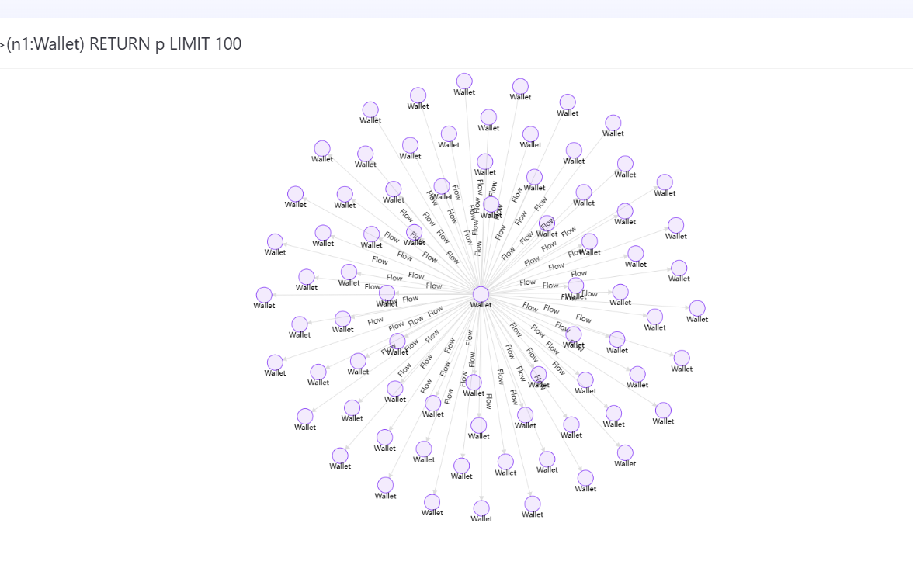


## 操作实验（基于 trans 数据）

### 查看
看看有没有「非法交易（class=1）」直接流向「未知交易」的实时例子  
```cypher
MATCH (bad:Transaction {class:'1'})-[f:Flow]->(unk:Transaction {class:'unknown'})
RETURN bad.txId AS 非法交易,
       unk.txId AS 流向未知交易,
       f.elementId AS 边ID
LIMIT 5
```
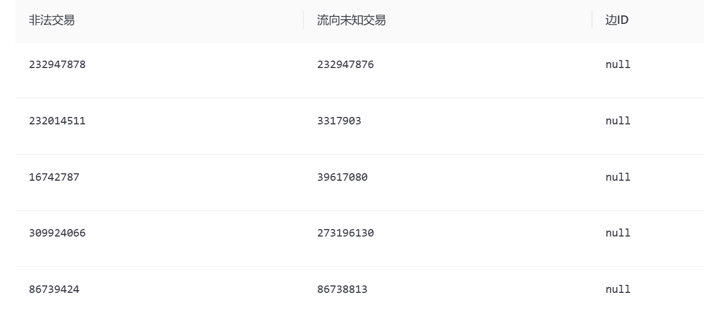

### 删除
发现测试脏数据，先备份再删除  
```cypher
MATCH (c:Transaction {txId:'100000185'})-[r:Flow]-(o)
WITH c, o, r
RETURN c.txId AS 中心节点, o.txId AS 对方节点, r.elementId AS 将被删边ID
```
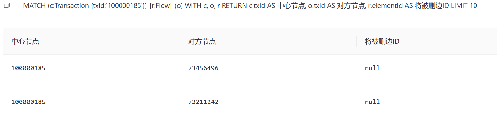

```cypher
MATCH (c:Transaction {txId:'100000185'})-[r:Flow]-(o)
DELETE r
```
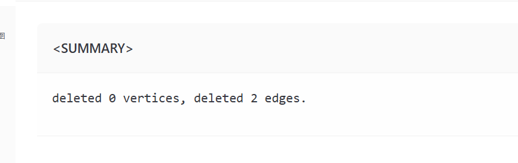

### 复杂查询（多层追溯 + 聚合）
找出所有「非法交易（class=1）」2 步内流出去的「未知交易」，并统计每个未知交易被多少条不同路径命中。  
```cypher
MATCH (bad:Transaction {class:'1'})-[:Flow*1..2]->(unk:Transaction {class:'unknown'})
RETURN unk.txId AS unkTx,
       count(DISTINCT bad.txId) AS srcCnt,
       count(*) AS pathCnt
ORDER BY pathCnt DESC
LIMIT 10
```
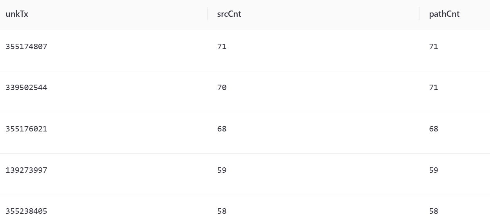
